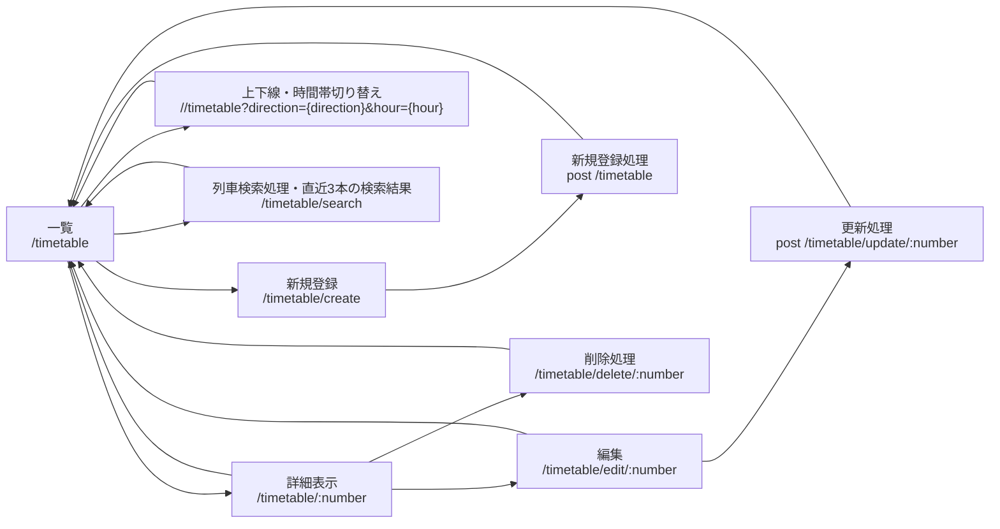

```mermaid
flowchart LR
%%{init: {"htmlLabels": false, "flowchart": {"wrappingWidth": 350}}}%%
    A["一覧<br/>/timetable"]
    B["詳細表示<br/>/timetable/:number"]
    C["編集<br/>/timetable/edit/:number"]
    D["更新処理<br/>post /timetable/update/:number"]
    E["新規登録<br/>/timetable/create"]
    F["新規登録処理<br/>post /timetable"]
    G["削除処理<br/>/timetable/delete/:number"]
    H["上下線・時間帯切り替え<br/>//timetable?direction={direction}&hour={hour}"]
    I["列車検索処理・直近3本の検索結果<br/>/timetable/search"]
    A --> B
    B --> A
    B --> C
    C --> D
    C --> A
    D --> A

    A --> E
    E --> F
    F --> A

    B --> G
    G --> A

    A --> H
    H --> A

    A --> I
    I --> A
```